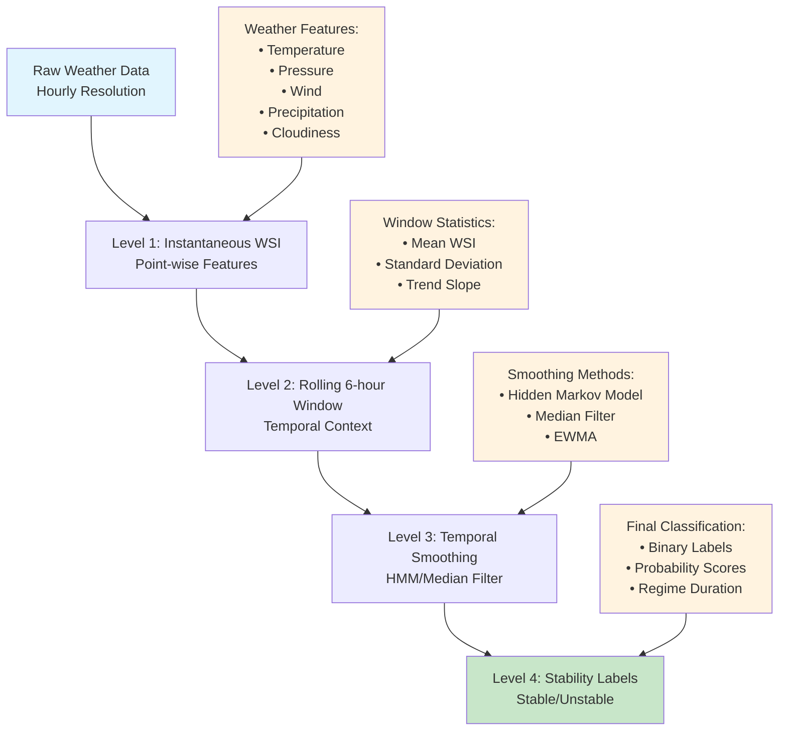
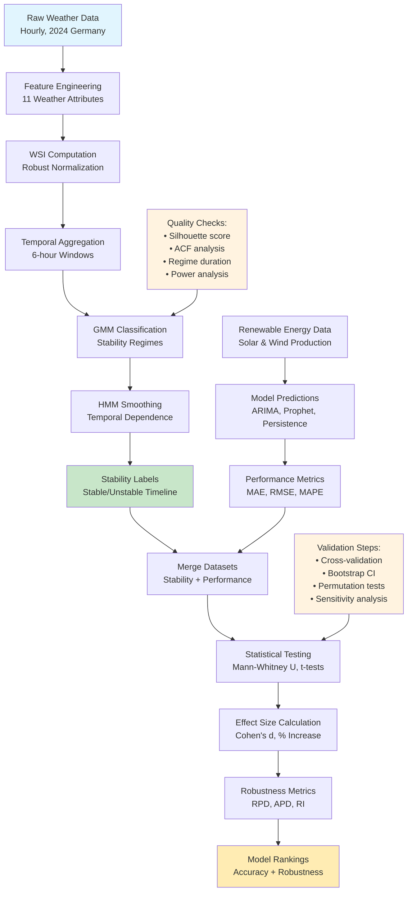
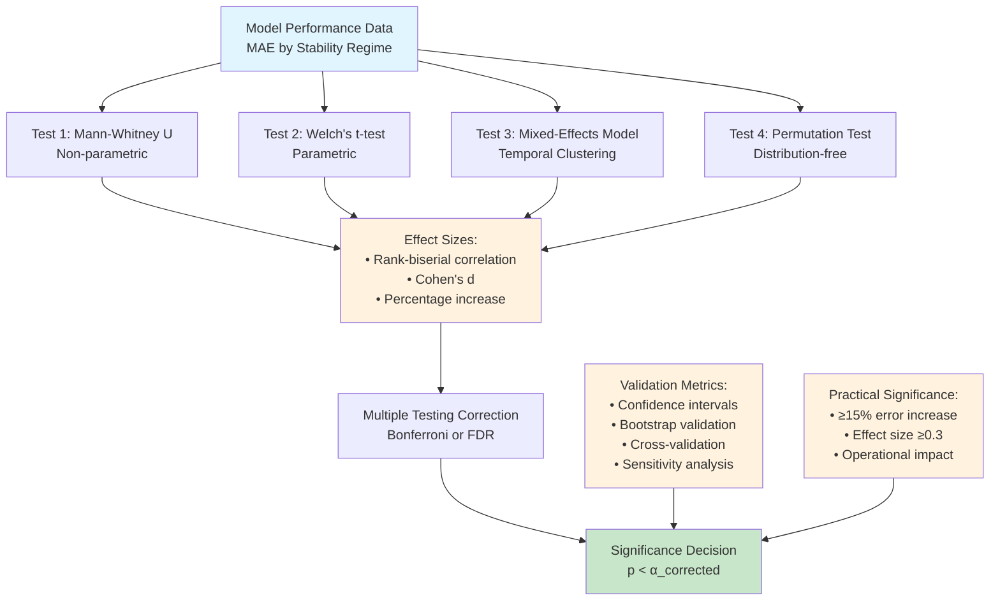
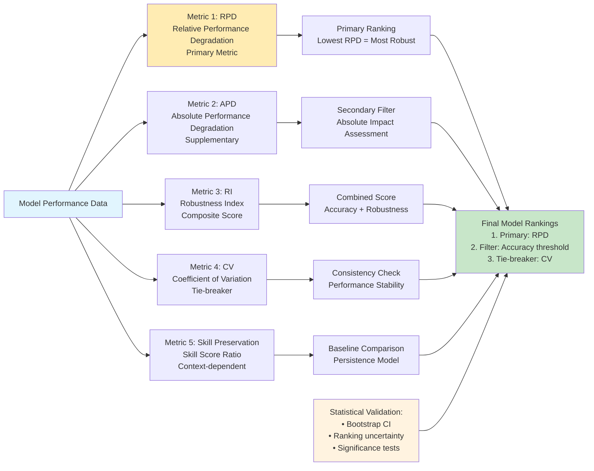
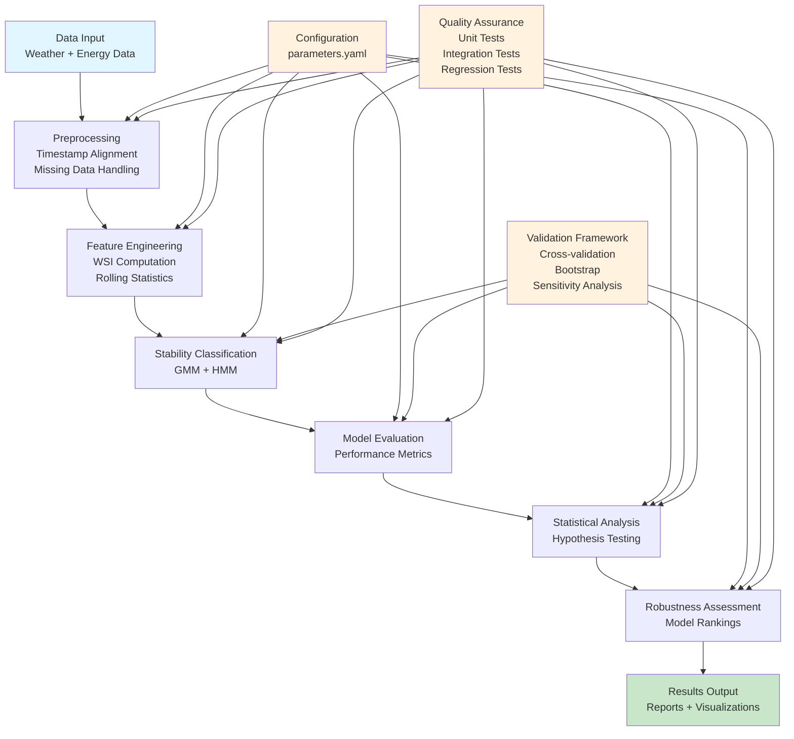

# Conceptual Diagrams for Statistical Methodology Framework

## Figure 1: Multi-Scale Temporal Hierarchy



## Figure 2: Hidden Markov Model State Transitions

```mermaid
graph LR
    S1[Stable State<br/>S₁] --> S2[Unstable State<br/>S₂]
    S2 --> S1
    S1 --> S1
    S2 --> S2
    
    S1 -.-> O1[Observations:<br/>Low WSI<br/>Low Variability<br/>Stable Trends]
    S2 -.-> O2[Observations:<br/>High WSI<br/>High Variability<br/>Rapid Changes]
    
    T1[Transition Probabilities:<br/>P(S₂|S₁) = 0.1<br/>P(S₁|S₂) = 0.3<br/>P(S₁|S₁) = 0.9<br/>P(S₂|S₂) = 0.7]
    
    E1[Emission Probabilities:<br/>P(O|S₁) ~ N(μ₁, σ₁²)<br/>P(O|S₂) ~ N(μ₂, σ₂²)]
    
    style S1 fill:#c8e6c9
    style S2 fill:#ffcdd2
    style O1 fill:#e8f5e8
    style O2 fill:#ffe8e8
    style T1 fill:#fff3e0
    style E1 fill:#fff3e0
```

## Figure 3: Validation Pipeline Flowchart



## Figure 4: Statistical Test Framework



## Figure 5: Robustness Metrics Comparison



## Figure 6: Implementation Architecture


